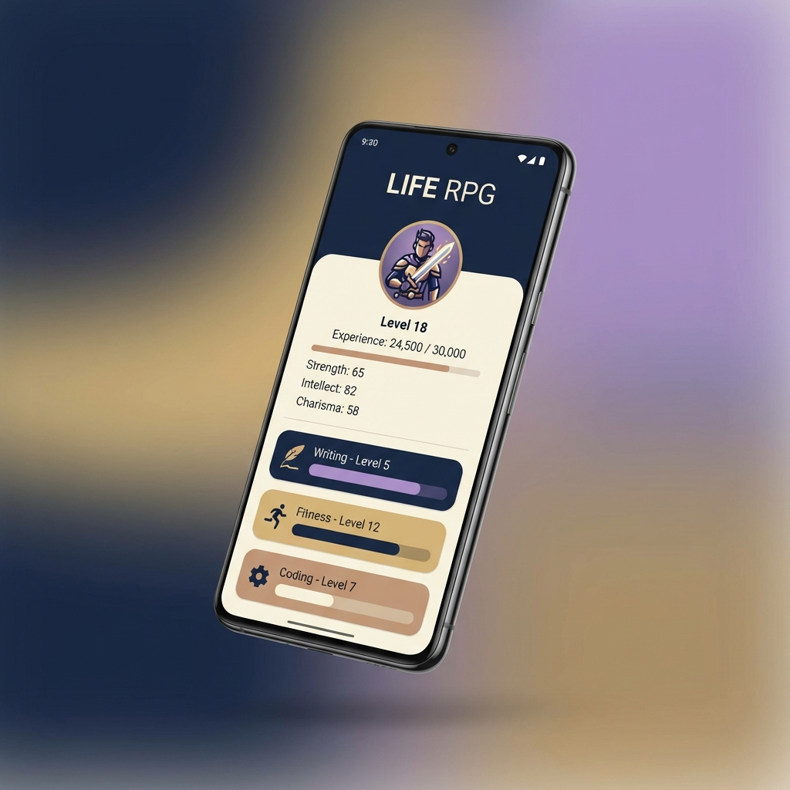

<div align="center">
  
  <br>
  <i>*Visual representation generated with Gemini. Actual app UI may vary.*</i>
  
  # 🛡️ Life RPG
  
  **Transform your life into an epic adventure.**
  
  [](https://flutter.dev)
  [](https://firebase.google.com)
  [](LICENSE)
  [](CONTRIBUTING.md)
  
  > [!WARNING]
  > **Early Stage Project**: This application is currently in a very early stage of development. Features may change rapidly, and you might encounter bugs. Contributions and feedback are highly welcome!

  *Life RPG is a gamified productivity application built with Flutter. It helps you track your real-life skills and progress as if you were a character in an RPG.*
</div>

---

## ✨ Features

- 🎮 **Gamified Progress**: Earn XP for your real-life activities and level up your skills.
- 📊 **Dynamic Analytics**: Visualize your growth over time with interactive charts.
- 🌓 **Premium Theming**: Beautiful Light and Dark modes with hand-picked Color Hunt palettes.
- 🌍 **Internationalization**: Full support for **German** (Default) and **English**.
- 🔐 **Secure Persistence**: Firebase integration for secure data syncing across devices.
- 🚀 **Guest Mode**: Try the app instantly without creating an account.
- 🏗 **Clean Architecture**: Built with scalability and maintainability in mind.

## 🛠 Tech Stack

- **Framework**: [Flutter](https://flutter.dev/) (Web, Android, iOS)
- **State Management**: [Riverpod 3.1.0+](https://riverpod.dev/) using code generation.
- **Navigation**: [GoRouter 17.0.1+](https://pub.dev/packages/go_router)
- **Backend/Auth**: [Firebase](https://firebase.google.com/) (Auth & Cloud Firestore)
- **I18n**: [intl](https://pub.dev/packages/intl)
- **Charts**: [fl_chart](https://pub.dev/packages/fl_chart)
- **Persistence**: [shared_preferences](https://pub.dev/packages/shared_preferences)

## 🏗 Architecture

The project follows strictly decoupled **Clean Architecture** principles:

1.  **Domain Layer**: Pure Dart logic. Contains Entities, Repository Interfaces, and Use Cases.
2.  **Data Layer**: Repository implementations, DTOs, and Data Sources (Firebase).
3.  **Presentation Layer**: State Management (Riverpod) and UI (Flutter Widgets).

```text
lib/
├── core/             # Theme, Router, I18n, Global Providers
├── features/         # Feature-first structure
│   ├── skill/        # Core skill tracking & leveling logic
│   ├── analytics/    # Performance charts & stats
│   ├── auth/         # Authentication (Email, Guest, Profile)
│   ├── home/         # Dashboard & Quick Actions
│   ├── profile/      # Profile management
│   └── settings/     # User preferences
└── main.dart         # App entry
```

## 🚦 Getting Started

### Prerequisites

- [Flutter SDK](https://docs.flutter.dev/get-started/install) (latest stable)
- [Firebase CLI](https://firebase.google.com/docs/cli) (required for setup)

### Installation

1.  **Clone the repository**:
    ```bash
    git clone https://github.com/plaub/life_rpg.git
    cd life_rpg
    ```

2.  **Install dependencies**:
    ```bash
    flutter pub get
    ```

3.  **Run Code Generation**:
    The project uses `build_runner` for Riverpod and JSON serialization:
    ```bash
    dart run build_runner build --delete-conflicting-outputs
    ```

4.  **Configure Firebase**:
    Security first! Production Firebase config files are excluded. To run the app, link it to your own Firebase project:
    ```bash
    # Install FlutterFire CLI
    dart pub global activate flutterfire_cli

    # Configure the project
    flutterfire configure
    ```
    *Note: Enable **Email/Password** and **Anonymous** auth in your Firebase Console.*

### Running the App

```bash
flutter run -d chrome  # Web
flutter run            # Mobile (requires emulator/real device)
```

## 🤝 Contributing

Contributions are what make the open-source community such an amazing place to learn, inspire, and create. Any contributions you make are **greatly appreciated**.

1. Fork the Project
2. Create your Feature Branch (`git checkout -b feature/AmazingFeature`)
3. Commit your Changes (`git commit -m 'Add some AmazingFeature'`)
4. Push to the Branch (`git push origin feature/AmazingFeature`)
5. Open a Pull Request

## 📄 License

Distributed under the Apache License 2.0. See `LICENSE` for more information.

---

<div align="center">
  Built with ❤️ by [plaub](https://github.com/plaub)
</div>
